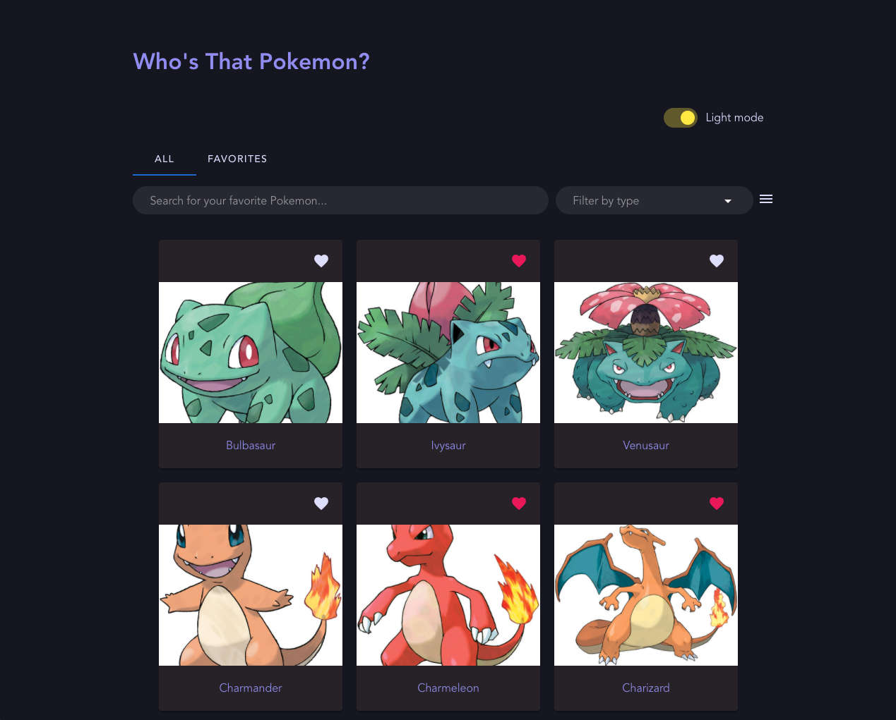

## Who's that Pokemon?

Info included in this page:
- Available Commands
- Features
- Additional Docs

### Sample Images 
The Pokedex has three main pages, in both light and dark mode:

- the home page (gallery)
    - 
- the individual Pokemon page (detail)
    -  

- and finally the catch-all _Not Found_ page:
    -  
### Available commands

- `npm run serve` -- spins up the frontend made available on [http://localhost:8081/](http://localhost:8081/)
- `npm run test:unit` -- runs the unit tests and builds a coverage report at the root
- `npm run test:e2e` -- runs the e2e test on cypress

### Features
#### App Features
- Ability to favorite and unfavorite pokemons with toast notifications
- Subtle fade page transitions
- Not-found page for visits to any `:name` pathname that doesn't correspond to a pokemon
- Night mode

#### Dev Features
- Use of typescript for type safety
- Error logging from API calls
- Cypress, jest configuration with coverage reports with e2e + unit testing
- Web hooks on commit

#### By Page Navigation 
- Home page with
    - filtered pokemon via type
    - tabs to search by all or favorites only
    - ability to toggle favorites
    - grid and list view
    - clicking on a pokemon `name` navigates to `/:name`
- Individual Pokemon view
    - ability to toggle favorite
    - speaker icon that can play pokemon sound
    - info on evolutions
- Not Found page
    - When navigating to `/:name` but `name` does not exist
    - link to return back home 

#### Wish List / if there was more time:
- Demo video
- Inifinite scroll!!
- More tests + introduce mocks <--- 
- Ability to create a new pokemon
- Data on how each pokemon stacks up against the others (analyzing and displaying height, width, etc. against others)
- Display data a bit nicer on the detail's page
- Night mode involves removing white space from photos
- A more responsive layout 
- Require conventional commit template with issue # or JIRA #
